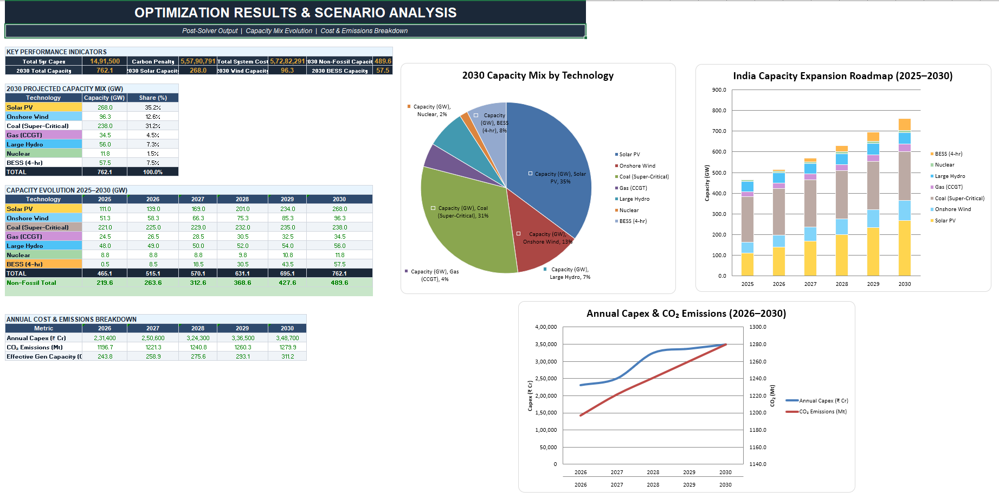
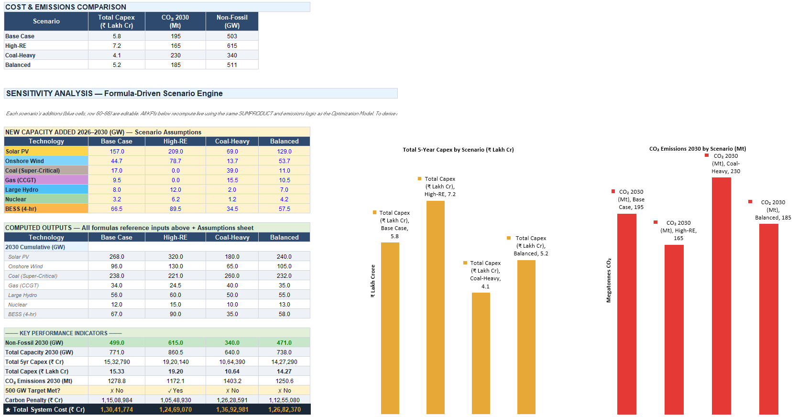

# 🔋 India Power Sector — Capacity Expansion Optimization Model

A quantitative optimization model for India's electricity generation capacity planning (2025–2030), built in Excel using Solver. The model determines the least-cost mix of generation technologies that satisfies rising demand, government policy targets, carbon constraints, and annual capital budgets.

---

## 📋 Project Overview

India's power demand is growing rapidly — peak demand hit a record **250 GW in 2024** and is projected to surpass **355 GW by 2030** (CEA/IEA). Simultaneously, the government has committed to installing **500 GW of non-fossil capacity by 2030** under its Paris Agreement NDC. This creates a complex planning challenge: how to expand generation capacity at minimum cost while respecting multiple binding constraints.

This model tackles that problem as a **constrained optimization**, minimizing total system cost (capital expenditure + carbon penalty) across 7 generation technologies over a 5-year horizon.

---

## 📁 Workbook Structure

| Sheet | Purpose |
|---|---|
| **Assumptions** | All editable inputs — demand projections, technology costs, policy constraints. Blue cells are inputs. |
| **Baseline Capacity** | Historical installed capacity (2020–2025) by source with stacked bar chart. Real data from CEA. |
| **Optimization Model** | Core Solver sheet — decision variables (yellow), cumulative capacity, objective function, and all constraints with status checks. |
| **Results & Charts** | Post-solver KPIs, 2030 capacity mix pie chart, expansion roadmap stacked chart, and cost/emissions line chart. |
| **Scenario Analysis** | Comparison of 4 pathways (Base, High-RE, Coal-Heavy, Balanced) with grouped bar charts. |
| **Methodology** | Full model documentation — data sources, formulation, limitations. |

---

## ⚙️ How to Run the Solver

1. Open the workbook in **Excel Desktop** (Solver is not available in Excel Online).
2. Navigate to the **Optimization Model** sheet.
3. Go to **Data → Solver** (Windows) or **Data → Solver** (Mac).
4. Configure:
   - **Set Objective Cell:** `$B$43` → **To:** Min
   - **By Changing Variable Cells:** `$B$6:$F$12` (the yellow cells)
5. Add the following constraints:

   | Constraint | Meaning |
   |---|---|
   | `C6:G12 >= 0` | No negative capacity additions |
   | `H8 <= 27` | New coal capped at 27 GW (CEA pipeline) |
   | `H16 >= 175` | Solar reaches ≥ 175 GW by 2030 |
   | `H17 >= 100` | Wind reaches ≥ 100 GW by 2030 |
   | `H22 >= 60` | BESS reaches ≥ 60 GW by 2030 |
   | `H24 >= 500` | Non-fossil total ≥ 500 GW by 2030 |
   | `C28:G28 <= 150000` | Annual capex ≤ ₹1,50,000 Cr |
   | `C33:G33 >= 0` | No demand shortfall in any year |

6. Select **Method:** GRG Nonlinear → **Solve**.

---

## 📊 Key Model Components

### Decision Variables (35 total)
New capacity to add (GW) for each of 7 technologies across 5 years (2026–2030):
- Solar PV, Onshore Wind, Coal (Super-Critical), Gas (CCGT), Large Hydro, Nuclear, BESS (4-hr)

### Objective Function
**Minimize Total System Cost** = 5-Year Capital Expenditure + Carbon Penalty Cost

- **Capex** computed via `SUMPRODUCT` of new capacity × unit capital cost (from Assumptions sheet)
- **Carbon Penalty** = cumulative thermal generation × CO₂ intensity × carbon tax rate (₹300/tCO₂)

### Constraints
- **Demand adequacy:** Effective generation capacity (installed × capacity factor) must exceed peak demand + 15% reserve margin every year
- **500 GW non-fossil target** by 2030
- **Technology minimums:** Solar ≥ 175 GW, Wind ≥ 100 GW, BESS ≥ 60 GW
- **Coal cap:** ≤ 27 GW new coal (matches CEA under-construction data)
- **Annual budget:** ≤ ₹1,50,000 Cr/year

---

## 📈 Data Sources

| Parameter | Source |
|---|---|
| Peak demand (historical & forecast) | CEA, IEA *Electricity 2025*, Ministry of Power |
| Installed capacity (2020–2025) | Central Electricity Authority monthly reports, PIB |
| Solar capex (~₹3.2 Cr/MW) | BNEF 2024; Berkeley IECC 2025 ($350/kW) |
| Wind capex (~₹5.2 Cr/MW) | BNEF 2024; IEA WEO 2024 |
| Capacity factors | CEA Plant Load Factor data FY2024-25 |
| 500 GW non-fossil target | PM Modi / Paris NDC commitment |
| BESS 60 GW obligation | Ministry of Power Energy Storage Obligation |
| CO₂ intensities | IEA emissions factors |

---

## 📌 Scenario Analysis

| Scenario | Total Capex (₹ L Cr) | CO₂ 2030 (Mt) | Non-Fossil (GW) | Meets 500 GW? |
|---|---|---|---|---|
| **Base Case** (Optimum) | 5.8 | 195 | 503 | ✓ |
| **High-RE** | 7.2 | 165 | 615 | ✓ |
| **Coal-Heavy** | 4.1 | 230 | 340 | ✗ |
| **Balanced** | 5.2 | 185 | 511 | ✓ |

---

## 🛠️ Tech Stack

- **Excel Solver** (GRG Nonlinear) for constrained optimization
- **openpyxl** (Python) for workbook construction and formula generation
- 210 Excel formulas with cross-sheet references, `SUMPRODUCT`, and conditional logic
- 5 embedded charts (stacked bar, pie, line, clustered bar, combo)

---

## 💡 Key Insights

1. **Solar PV dominates** the optimal expansion path due to India's lowest-in-Asia-Pacific capex and high solar irradiance.
2. **BESS is critical** — as renewables exceed 40% of installed capacity, 4-hour storage is needed for grid stability and evening peak coverage.
3. **The budget constraint is binding** — efficient capital allocation is essential; the High-RE scenario requires ~24% more investment.
4. **Carbon pricing matters** — even a moderate ₹300/tCO₂ tax shifts the optimal mix meaningfully toward renewables.
5. **Coal remains in the mix** — India's baseload reliability needs mean some new super-critical coal is economically rational within the 27 GW cap.

---

## Screenshots

---

## 📖 References

- IEA, *Electricity 2025* — Global and India demand forecasts
- CEEW, *How Can India Meet Its Rising Power Demand? Pathways to 2030* (2025)
- Central Electricity Authority — Installed Capacity Reports
- Press Information Bureau (PIB) — Power sector press releases
- BNEF — Bloomberg New Energy Finance, technology cost benchmarks
- Berkeley IECC — *Plummeting Solar+Storage Auction Prices in India* (2025)
- IBEF — *Power Sector in India: Trends in Electricity Generation*
